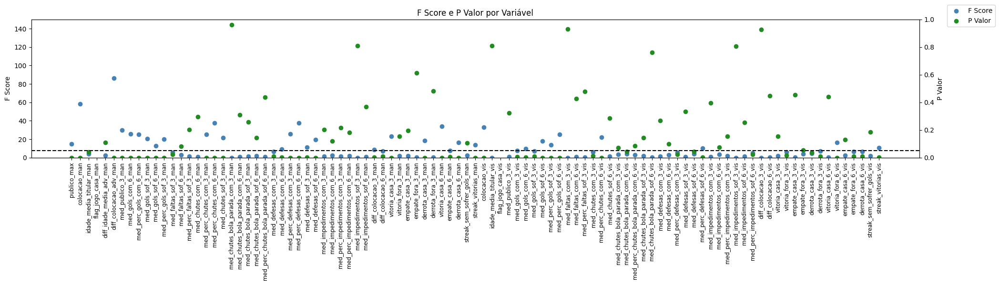
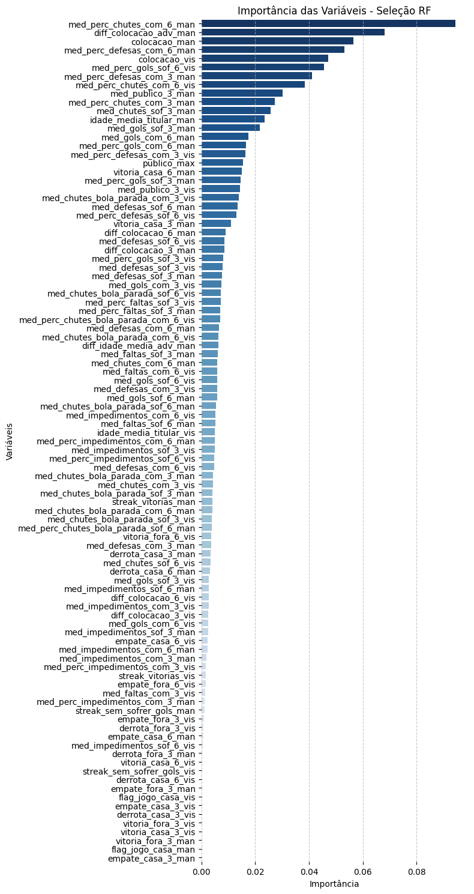

# Brasileirão Série A

Este é um projeto que utiliza dados históricos (desde 2003) do Campeonato Brasileiro Serie A. Os dados disponíveis contém informações de estatísticas de partidas tanto para o time mandante quanto visitante tais como chutes, faltas, gols, impedimentos bem como informações específicas do time, como idade media do time titular, técnico, valor da equipe, etc.

O objetivo deste projeto é criar um Modelo de Classificação para prever a vitória do time mandante em uma determinada partida. Para isso, é necessário realizar uma Análise Exploratória dos Dados, criação de um Modelo de Classificação, criação de uma Estratégia de Apostas. Por fim, realizar o Deploy do Modelo. 

Fonte dos dados: [Base dos Dados - Brasileirao Serie A](https://basedosdados.org/dataset/c861330e-bca2-474d-9073-bc70744a1b23?table=18835b0d-233e-4857-b454-1fa34a81b4fa)

| Campo                          | Descrição                                          |
|--------------------------------|----------------------------------------------------|
| ano_campeonato                 | Ano do campeonato                                  |
| data                           | Data da partida                                   |
| rodada                         | Rodada                                             |
| estadio                        | Estádio                                            |
| arbitro                        | Árbitro                                            |
| publico                        | Público presente                                   |
| publico_max                    | Público máximo                                     |
| time_mandante                  | Time mandante                                      |
| time_visitante                 | Time visitante                                     |
| tecnico_mandante               | Técnico do time mandante                           |
| tecnico_visitante              | Técnico do time visitante                          |
| colocacao_mandante             | Colocação do time mandante                         |
| colocacao_visitante            | Colocação do time visitante                        |
| valor_equipe_titular_mandante  | Valor da equipe titular do time mandante           |
| valor_equipe_titular_visitante | Valor da equipe titular do time visitante          |
| idade_media_titular_mandante   | Idade média da equipe titular do time mandante     |
| idade_media_titular_visitante  | Idade média da equipe titular do time visitante    |
| gols_mandante                  | Gols do time mandante                              |
| gols_visitante                 | Gols do time visitante                             |
| gols_1_tempo_mandante          | Gols no primeiro tempo do time mandante            |
| gols_1_tempo_visitante         | Gols no primeiro tempo do time visitante           |
| escanteios_mandante            | Escanteios do time mandante                         |
| escanteios_visitante           | Escanteios do time visitante                        |
| faltas_mandante                | Faltas feitas pelo time mandante                   |
| faltas_visitante               | Faltas feitas pelo time visitante                  |
| chutes_bola_parada_mandante    | Chutes de bola parada do time mandante             |
| chutes_bola_parada_visitante   | Chutes de bola parada do time visitante            |
| defesas_mandante               | Defesas do time mandante                           |
| defesas_visitante              | Defesas do time visitante                          |
| impedimentos_mandante          | Impedimentos do time mandante                      |
| impedimentos_visitante         | Impedimentos do time visitante                     |
| chutes_mandante                | Chutes do time mandante                            |
| chutes_visitante               | Chutes do time visitante                           |
| chutes_fora_mandante           | Chutes fora do time mandante                       |
| chutes_fora_visitante          | Chutes fora do time visitante                      |


## Tabela de Conteúdo
- [Brasileirão Série A](#brasileirão-série-a)
  - [Tabela de Conteúdo](#tabela-de-conteúdo)
  - [01. Análise Exploratória dos Dados (EDA) 📊](#01-análise-exploratória-dos-dados-eda-)
    - [Evolução temporal:](#evolução-temporal)
    - [Descritiva das variáveis numéricas:](#descritiva-das-variáveis-numéricas)
    - [Análise de Desempenho:](#análise-de-desempenho)
  - [02. Engenharia de Features 👨‍🔬💡](#02-engenharia-de-features-)
    - [Variaveis Pontuais](#variaveis-pontuais)
    - [Variaveis Janeladas](#variaveis-janeladas)
    - [Análise de Missings](#análise-de-missings)
    - [Encoding nas variáveis categóricas](#encoding-nas-variáveis-categóricas)
  - [03. Seleção de Features e Pré-processamento dos dados ☑️](#03-seleção-de-features-e-pré-processamento-dos-dados-️)
    - [1. Remoção de multicolinearidade entre as variáveis independentes.](#1-remoção-de-multicolinearidade-entre-as-variáveis-independentes)
    - [2. Estatística Univariada por ANOVA (F-Score).](#2-estatística-univariada-por-anova-f-score)
    - [3. Model Based - Seleção baseada em Random Forest.](#3-model-based---seleção-baseada-em-random-forest)
  - [04. Treinamento do Modelo ⚙️🧠](#04-treinamento-do-modelo-️)


## 01. Análise Exploratória dos Dados (EDA) 📊

### Evolução temporal:

- Qual ano teve mais jogos?

        ano_campeonato
        2003-01-01    456
        2004-01-01    456
        2005-01-01    418
        2006-01-01    380
        2007-01-01    380
        2008-01-01    380
        2009-01-01    380
        2010-01-01    380
        2011-01-01    380
        2012-01-01    380
        2013-01-01    380
        2014-01-01    380
        2015-01-01    380
        2016-01-01    380
        2017-01-01    380
        2018-01-01    380
        2019-01-01    380
        2020-01-01    380
        2021-01-01    380
        2022-01-01    380
        2023-01-01    259
        Name: count, dtype: int64

O ano que mais tiveram jogos pelo Brasileirao foram os anos de 2003 e 2004 com 456 jogos.

- Como se comporta o publico ao longo dos anos?


Aparentemente há uma divergencia nos dados de publico para o ano de 2008, onde há uma grande quantidade de zeros.

A partir de 2016, observa-se uma crescente no publico presente nos estádios. No entanto, o efeito da pandemia do Covid-19 no ano de 2020 impediu este avanço fazendo com que os jogos fossem fechados ao publico.

Os públicos agrupados por vitorias, empates e derrotas do tima mandante tem distribuições parecidas (assimetrica positiva). No entanto, a frequência é bem maior quando o time mandante vence.

- Como se comporta a média de gols por rodada ao longo do tempo?
  


Oberva-se que os gols ao longo das rodadas do campeonato nao seguem um padrão específico mostrando muitas vezes valores discrepantes. No entanto, nota-se que no ano de 2005 há uma maior variação nos gols marcados. 

Normalmente os times mandantes (linha tracejada em verde) faz mais gols, em média, do que os times visitantes (linha tracejada vermelha)

### Descritiva das variáveis numéricas:


-   Podemos observar que existe certa divergência nos dados relacionados à idade media do time titular e visitante. 

-   Também observamos que existe uma anomalia nos dados de valor equipe titular mandante e visitante, onde os dados para 2023 estão zerados. 

-    Há uma mudança de patamar no que diz respeitos aos chutes mandante e visitante.

A inconsistência para a idade se inicia no ano de 2023 e pode estar relacionado a algum erro de digitação (por exemplo, idade * 10). Vamos observar agora como seria a distribuição caso dividíssemos o valor por 10. Para isso, vamos olhar apenas 2022 e 2023:


    idade_media_titular_man (2022) x idade_media_titular_man (2023):
	ks: 0.05728510465352571
	p_value: 0.6648702967703334
    As distribuições são estatisticamente parecidas

    idade_media_titular_vis (2022) x idade_media_titular_vis (2023):
    ks: 0.07984149563096932
    p_value: 0.2617445972749839
    As distribuições são estatisticamente parecidas

**As analises abaixo levam em consideração dados a partir de 2022:**

- Qual estádio teve mais jogos em quantidade?
- Qual estádio teve o melhor aproveitamento do time mandante?
- Qual estádio teve o pior aproveitamento do time mandante?


O estádio que teve mais jogos foi o Estádio Jornalista Mário Filho (Maracanã), seguido do Estádio Governador Plácido Castelo (Castelão).

O estádio com melhor aproveitamento (vitorias - derrotas) também é o Estádio Jornalista Mário Filho.

O estádio com o pior aproveitamento (derrotas - vitorias) é o Estádio Alfredo Jaconi.

OBS: O Estádio Jornalista Mário Filho (Maracanã) pode ter diferentes times mandantes. Isso explica a grande quantidade de jogos bem como um bom aproveitamento nos jogos.

- Qual árbitro apitou mais jogos?
- Qual árbitro apitou mais vitorias em % para o time mandante? 
- Qual árbitro apitou mais derrotas em % para o time mandante? 


Ramon Abatti, Braulio Machado, Flavio Souza, Raphael Claus e Anderson Daronco são os 5 árbitros que mais apitam jogos no Brasileirao.

Alexandre Tavares, Jefferson Moraes, Antonio Souza e Arthur Rabelo, apesar das poucas quantidades de jogo apitados, são os árbitros que mais dão "sorte" ao time mandante.

Yuri Cruz, Denis Serafim, Paulo Henrique Volkopof e Jean Pierre Lima lideram a arbitragem que traz "azar" ao time mandante.

- Qual torcida mais lota o estádio?


Em méda, Flamengo é o time que mais lota o estádio do time mandante, seguido por Corinthians, São Paulo, Palmeiras, Atlético MG e Fortaleza.

- Qual equipe mais cara?
(como os dados de 2023 estão zerados, vamos observar apenas até 2022 para essa variavel)


Em média, Flamengo, Palmeiras e Atlético-MG detém os elencos mais caros.

- Qual a equipe mais jovem?
  


RB Bragantino, Atlético-PR, Vasco da Gama e Santos são as 3 equipes mais jovens

### Análise de Desempenho:

- Quais times marcaram mais gols? Quais sofreram mais gols?
  


Os times que lideram na marcação de gols são o Palmeiras, Flamengo e Botafogo.

Os time que mais sofreram gols são o Juventude, Coritiba, e Avaí mostrando desempenho negativos.

- Quais tecnicos tem os melhores e piores desempenhos?


Os técnicos que se destacam em desempenho positivo são: Cláudio Caçapa, Cauan Almeida, Mário Jorge, Marcelo Fernandes, Renato Portaluppi, Abel Ferreira e Fernando Diniz.

Os técnicos com piores desempenhos são: Antonio Zago, Celso Roth, Lucas Zanella, Umberto Louzer entre outros...

OBS: A visão do desempenho leva em consideração a relação de vitorias, empates e derrotas pelo total de jogos. Sendo assim, um tecnico com desempenho muito bom pode ter comandado apenas poucos jogos e o mesmo vale para um técnico com desempenho ruim.

- Existe alguma relação entre o valor da equipe titular e o desempenho do time?
- Existe alguma relação entre a idade da equipe titular e o desempenho do time?

Como os dados de valor equipe para 2023 estao impactados, vamos tirá-lo desta analise


Equipes mais caras tendem a trazer mais vitoria para o time, isto pois jogadores mais caros são mais habilidosos e agregam mais para o time. No entanto, a média da Idade do time titular nao diferencia no desempenho da equipe.

## 02. Engenharia de Features 👨‍🔬💡

O objetivo é criar novas features com relação aos dados disponíveis. A visão a ser construida será por partida e time, ou seja, por rodada do campeonato.
- features pontuais da partida: visoes em percentual, quantidade, flag indicacao de jogo dentro ou fora (parte delas serão variáveis auxiliares para as janeladas)
- features no tempo: observações de tendências

Ao final, a ideia é adicionar essas novas features ao dataframe ao qual vamos modelos (a partir de 2018), tanto para time mandante quanto visitante.

### Variaveis Pontuais

```python
def features_pontuais(df):
    df_man = df.copy()
    df_vis = df.copy()

    totais = ['escanteios','faltas','impedimentos','chutes','chutes_bola_parada','chutes_fora','defesas','gols']
    renom = ['colocacao','time','tecnico','valor_equipe_titular','idade_media_titular']
    dfs = [df_man, df_vis]

    for i in range(len(dfs)):
        df = dfs[i]    
        df['vitoria_man'] = df['vitoria_man'].astype(int)  
        if i == 0:
            df['flag_jogo_casa'] = 1
            df['diff_idade_media_adv'] = df['idade_media_titular_man'] - df['idade_media_titular_vis']
            df['diff_valor_equipe_adv'] = df['valor_equipe_titular_man'] - df['valor_equipe_titular_vis']
            df['diff_colocacao_adv'] = df['colocacao_man'] - df['colocacao_vis']
            # Auxiliares
            for c in totais:
                df[f'{c}_totais'] = df[f'{c}_man'] + df[f'{c}_vis']
                df[f'perc_{c}_com'] = df[f'{c}_man'] / df[f'{c}_totais']
                df[f'perc_{c}_sof'] = df[f'{c}_vis'] / df[f'{c}_totais']    
                df.rename(columns={f'{c}_man' : f'{c}_com'}, inplace=True)     
                df.rename(columns={f'{c}_vis' : f'{c}_sof'}, inplace=True)
            for r in renom:
                df.rename(columns={f'{r}_man' : f'{r}'}, inplace=True)
            # df.rename(columns={f'gols_man' : f'gols_com'}, inplace=True)
            # df.rename(columns={f'gols_vis' : f'gols_sof'}, inplace=True)
            df.rename(columns={f'vitoria_man' : f'vitoria'}, inplace=True)
            df['time_adversario'] = df['time_vis']         

        elif i == 1:
            df['flag_jogo_casa'] = 0
            df['diff_idade_media_adv'] = df['idade_media_titular_vis'] - df['idade_media_titular_man']
            df['diff_valor_equipe_adv'] = df['valor_equipe_titular_vis'] - df['valor_equipe_titular_man']
            df['diff_colocacao_adv'] = df['colocacao_vis'] - df['colocacao_man']
            # Auxiliares
            for c in totais:
                df[f'{c}_totais'] = df[f'{c}_man'] + df[f'{c}_vis']
                df[f'perc_{c}_com'] = df[f'{c}_vis'] / df[f'{c}_totais']
                df[f'perc_{c}_sof'] = df[f'{c}_man'] / df[f'{c}_totais']     
                df.rename(columns={f'{c}_man' : f'{c}_sof'}, inplace=True)     
                df.rename(columns={f'{c}_vis' : f'{c}_com'}, inplace=True)    
            for r in renom:
                df.rename(columns={f'{r}_vis' : f'{r}'}, inplace=True)
            # df.rename(columns={f'gols_vis' : f'gols_com'}, inplace=True)
            # df.rename(columns={f'gols_man' : f'gols_sof'}, inplace=True)
            df.rename(columns={f'vitoria_man' : f'vitoria'}, inplace=True)
            df['vitoria'] = -df['vitoria']
            df['time_adversario'] = df['time_man']
        
        dropar = [k for k in df.columns if any(substring in k for substring in ['totais', 'man', 'vis'])]
        df.drop(columns=dropar, inplace=True)
        
    return pd.concat([df_man,df_vis]).reset_index()

```

### Variaveis Janeladas

```python

def features_num_janelas(df, variavel, janelas):
    for j in janelas:
        
        df[f'med_{variavel}_{j}'] = (
            df.groupby('time')[variavel]
            .rolling(window=j, min_periods=1, closed='left')
            .mean()
            .reset_index(level=0, drop=True)
        )        
        
    return df

def tecnicos_janelas(df, janela):
    for j in janela:
        df[f'qtd_tecnicos_distintos_{j}'] = (
             df.groupby('time')['tecnico']
            .apply(lambda x: x.rolling(window=j, min_periods=1, closed='left').apply(lambda y: y.nunique()))
            .reset_index(level=0, drop=True)
        )
    return df

def diff_colocacao(df, janela):
    for j in janela:
        df[f'diff_colocacao_{j}'] = df.groupby('time')['colocacao'].diff(j)
    return df

def resultado_dentro_fora(df,janela):
    for j in janela:
        df['vitoria_casa'] = (df['vitoria'] == 1) & (df['flag_jogo_casa'] == 1)
        df['derrota_casa'] = (df['vitoria'] == -1) & (df['flag_jogo_casa'] == 1)
        df['empate_casa'] = (df['vitoria'] == 0) & (df['flag_jogo_casa'] == 1)

        df['vitoria_fora'] = (df['vitoria'] == 1) & (df['flag_jogo_casa'] == 0)
        df['derrota_fora'] = (df['vitoria'] == -1) & (df['flag_jogo_casa'] == 0)
        df['empate_fora'] = (df['vitoria'] == 0) & (df['flag_jogo_casa'] == 0)

        for i in ['vitoria','empate','derrota']:
            for p in ['casa','fora']:
                pfx = f'{i}_{p}'
                df[f'{pfx}_{j}'] = (
                    df.groupby('time')[pfx]
                    .rolling(window=j, min_periods=1, closed='left')  
                    .sum()  
                    .reset_index(level=0, drop=True) 
                ) 
                df.drop(pfx,axis=1,inplace=True)

    return df

def rodadas_sem_sofrer_gols(df):
    '''
        Função para calcular rodadas consecutivas sem sofrer gols.
        Thanks to: https://predictivehacks.com/count-the-consecutive-events-in-python/
    '''
    df_aux = df.sort_values(by='data').copy()
    for time in np.unique(df_aux['time']):
        for ano in np.unique(df_aux['ano_campeonato'].dt.year):
            mask = (df_aux['time'] == time) & (df_aux['ano_campeonato'].dt.year == ano)
            df_time_temp = df_aux.loc[mask].sort_values(by='rodada').copy()
            df_time_temp = df_aux[(df_aux['time'] == time) & (df_aux['ano_campeonato'].dt.year == ano)] # Filtra time e temporada
            df_time_temp['golsof_jogo_ant'] = (df_time_temp['gols_sof'].shift(1) > 0).astype(int) # Flag se sofreu gol no jogo anterior
            df_time_temp['streak_sem_sofrer_gols'] = df_time_temp['golsof_jogo_ant'].\
                groupby((df_time_temp['golsof_jogo_ant'] != df_time_temp['golsof_jogo_ant'].shift()).cumsum()).cumcount() + 1 # Conta sequencia de rodada sem sofrer gol
            df_time_temp.loc[df_time_temp['golsof_jogo_ant']==1, 'streak_sem_sofrer_gols'] = 0 # Caso tenha sofrido gols, zerar o contador
            df_time_temp.drop(columns='golsof_jogo_ant',inplace=True)

            df_aux.loc[mask,'streak_sem_sofrer_gols'] = df_time_temp['streak_sem_sofrer_gols']

    return df_aux

def vitorias_consecutivas(df):
    '''
        Função para calcular rodadas consecutivas sem sofrer gols.
        Thanks to: https://predictivehacks.com/count-the-consecutive-events-in-python/
    '''
    df_aux = df.sort_values(by='data').copy()
    for time in np.unique(df_aux['time']):
        for ano in np.unique(df_aux['ano_campeonato'].dt.year):
            mask = (df_aux['time'] == time) & (df_aux['ano_campeonato'].dt.year == ano)
            df_time_temp = df_aux.loc[mask].sort_values(by='rodada').copy()
            df_time_temp = df_aux[(df_aux['time'] == time) & (df_aux['ano_campeonato'].dt.year == ano)] # Filtra time e temporada
            df_time_temp['vitoria_jogo_ant'] = (df_time_temp['vitoria'].shift(1) == 1).astype(int) # Flag se sofreu gol no jogo anterior
            df_time_temp['streak_vitorias'] = df_time_temp['vitoria_jogo_ant'].\
                groupby((df_time_temp['vitoria_jogo_ant'] != df_time_temp['vitoria_jogo_ant'].shift()).cumsum()).cumcount() + 1 # Conta sequencia de rodada sem sofrer gol
            df_time_temp.loc[df_time_temp['vitoria_jogo_ant']==0, 'streak_vitorias'] = 0 # Caso tenha sofrido gols, zerar o contador
            df_time_temp.drop(columns='vitoria_jogo_ant',inplace=True)

            df_aux.loc[mask, 'streak_vitorias'] = df_time_temp['streak_vitorias']
    
    return df_aux

variaveis = ['gols', 'faltas','chutes','chutes_bola_parada','defesas','impedimentos','chutes']
visao = ['com','sof'] #cometidos, sofridos

janelas = [3, 6]

df_ = features_num_janelas(df_, 'publico', janelas)

for variavel in variaveis:
    for vis in visao:
        v1 = f'{variavel}_{vis}'
        v2 = f'perc_{variavel}_{vis}'
        df_ = features_num_janelas(df_, v1, janelas)
        df_ = features_num_janelas(df_, v2, janelas)

# Chamada
df_ = features_pontuais(df)
# df_ = tecnicos_janelas(df_,[6,12])
df_ = diff_colocacao(df_,[3,6])
df_ = resultado_dentro_fora(df_,[3,6])
df_ = rodadas_sem_sofrer_gols(df_)
df_ = vitorias_consecutivas(df_)
```

### Análise de Missings

        ano_campeonato: 0 (0.00%)
        data: 0 (0.00%)
        rodada: 0 (0.00%)
        estadio: 0 (0.00%)
        arbitro: 0 (0.00%)
        publico: 0 (0.00%)
        publico_max: 28 (0.65%)
        time: 0 (0.00%)
        tecnico: 156 (3.61%)
        colocacao: 0 (0.00%)
        valor_equipe_titular: 46 (1.07%)
        idade_media_titular: 46 (1.07%)
        vitoria: 0 (0.00%)
        flag_jogo_casa: 0 (0.00%)
        diff_idade_media_adv: 46 (1.07%)
        diff_valor_equipe_adv: 46 (1.07%)
        diff_colocacao_adv: 0 (0.00%)
        time_adversario: 0 (0.00%)
        med_publico_3: 29 (0.67%)
        med_publico_6: 29 (0.67%)
        med_gols_com_3: 29 (0.67%)
        med_gols_com_6: 29 (0.67%)
        med_perc_gols_com_3: 31 (0.72%)
        med_perc_gols_com_6: 31 (0.72%)
        med_gols_sof_3: 29 (0.67%)
        med_gols_sof_6: 29 (0.67%)
        med_perc_gols_sof_3: 31 (0.72%)
        med_perc_gols_sof_6: 31 (0.72%)
        med_faltas_com_3: 543 (12.58%)
        med_faltas_com_6: 324 (7.50%)
        med_perc_faltas_com_3: 556 (12.88%)
        med_perc_faltas_com_6: 332 (7.69%)
        med_faltas_sof_3: 543 (12.58%)
        med_faltas_sof_6: 324 (7.50%)
        med_perc_faltas_sof_3: 556 (12.88%)
        med_perc_faltas_sof_6: 332 (7.69%)
        med_chutes_com_3: 543 (12.58%)
        med_chutes_com_6: 324 (7.50%)
        med_perc_chutes_com_3: 545 (12.62%)
        med_perc_chutes_com_6: 326 (7.55%)
        med_chutes_sof_3: 543 (12.58%)
        med_chutes_sof_6: 324 (7.50%)
        med_perc_chutes_sof_3: 545 (12.62%)
        med_perc_chutes_sof_6: 326 (7.55%)
        med_chutes_bola_parada_com_3: 543 (12.58%)
        med_chutes_bola_parada_com_6: 324 (7.50%)
        med_perc_chutes_bola_parada_com_3: 559 (12.95%)
        med_perc_chutes_bola_parada_com_6: 335 (7.76%)
        med_chutes_bola_parada_sof_3: 543 (12.58%)
        med_chutes_bola_parada_sof_6: 324 (7.50%)
        med_perc_chutes_bola_parada_sof_3: 559 (12.95%)
        med_perc_chutes_bola_parada_sof_6: 335 (7.76%)
        med_defesas_com_3: 543 (12.58%)
        med_defesas_com_6: 324 (7.50%)
        med_perc_defesas_com_3: 562 (13.02%)
        med_perc_defesas_com_6: 338 (7.83%)
        med_defesas_sof_3: 543 (12.58%)
        med_defesas_sof_6: 324 (7.50%)
        med_perc_defesas_sof_3: 562 (13.02%)
        med_perc_defesas_sof_6: 338 (7.83%)
        med_impedimentos_com_3: 543 (12.58%)
        med_impedimentos_com_6: 324 (7.50%)
        med_perc_impedimentos_com_3: 609 (14.10%)
        med_perc_impedimentos_com_6: 361 (8.36%)
        med_impedimentos_sof_3: 543 (12.58%)
        med_impedimentos_sof_6: 324 (7.50%)
        med_perc_impedimentos_sof_3: 609 (14.10%)
        med_perc_impedimentos_sof_6: 361 (8.36%)
        diff_colocacao_3: 87 (2.01%)
        diff_colocacao_6: 174 (4.03%)
        vitoria_casa_3: 29 (0.67%)
        vitoria_fora_3: 29 (0.67%)
        empate_casa_3: 29 (0.67%)
        empate_fora_3: 29 (0.67%)
        derrota_casa_3: 29 (0.67%)
        derrota_fora_3: 29 (0.67%)
        vitoria_casa_6: 29 (0.67%)
        vitoria_fora_6: 29 (0.67%)
        empate_casa_6: 29 (0.67%)
        empate_fora_6: 29 (0.67%)
        derrota_casa_6: 29 (0.67%)
        derrota_fora_6: 29 (0.67%)
        streak_sem_sofrer_gols: 0 (0.00%)
        streak_vitorias: 0 (0.00%)


Podemos observar que os valores missings estao concentrados em apenas uma porção da base de dados. Poderíamos dropá-los mas como estamos trabalhando com dados temporais, uma boa abordagem para a tratativa dos valores missings seria a interpolação. Para uma imputação mais segura, vamos olhar time a time.

Para a coluna "tecnico" vamos atribuir os valores missings como o último valor válido, ou seja, com o último técnico conhecido.

### Encoding nas variáveis categóricas

Como as variáveis categóricas (estadio, arbitro, time e tecnico) são variáveis nominais (não tem uma ordem definida), podemos adotar a estratégia de dummies ou de target encoding agrupando por faixas de taxa de vitória, o que tornaria uma variável ordinal.

Como essas variáveis possuem uma cardinalidade expressiva, isto é, com muitas categorias, a nossa estratégia será a de target encoding. No entanto, deve-se atentar a trabalhar com target encoding apenas no conjunto de treinamento de forma a evitar o que chamamos de data leakage.

Assim sendo, antes de realizar o encoding, devemos dividir nosso conjunto de treinamento em treino e teste.

OBS: Utilizar informação de arbitro e estadio pode trazer um certo viés ao modelo, uma vez que a vitoria depende muito mais do tecnico e do desempenho do time do que o árbitro/estádio.

-   Divisao em treino e teste
    -   Analise da distribuição das classes e volumetria ao longo dos anos


A taxa de vitoria se mostra relativamente estável ao longo do decorrer dos anos. Em termos de volumetria, nao temos todas as rodadas para o ano de 2023.

A nossa divisao dos conjuntos de treino e teste ser, a fim de respeitar o comportamento temporal, será:
-   Treino de 2018-2021
-   Teste 2022 e 2023

Agora, podemos dar prosseguimento ao processo de target encoding.

Vamos realizar o encoding através das médias suavizadas (smoothing). O objetivo é evitar médias instáveis quando o numero de casos de uma das categorias for pequeno. A fórmula do Smoothed Mean é calculada como:

```smooth = (counts * means + m * mean) / (counts + m)```

Onde:
- counts é o número de valores em cada grupo,
- means é a média de cada grupo,
- m é o parâmetro de suavização,
- mean é a média global.

As variáveis criadas com target encoding serão:

- tecnico_man_enc e tecnico_vis_enc
- time_man_enc e time_vis_enc

## 03. Seleção de Features e Pré-processamento dos dados ☑️

Tanto o pré-processamento dos dados quanto a seleção de features foram feitas sobre o conjunto de treinamento.

Primeiramente, o pré-processamento foi criado através de um pipeline de transformação no qual realiza o escalonamento dos dados com a regra de MinMaxScaler e imputação de valores missings utilizando a mediana. Em seguida, inicia-se as etapas de seleção de features:

### 1. Remoção de multicolinearidade entre as variáveis independentes.
- Para esta etapa, foi realizada análise de correlação (Pearson) entre todas as variáveis.
- Para variáveis altamente correlacionadas (limiar de 0.8), manteve-se aquela com maior correlação com a variável target.
  
### 2. Estatística Univariada por ANOVA (F-Score).
- Para as variáveis restantes da primeira etapa, foi observado o F-Score bem como o P-valor, no qual foi estabelecido um threshold de p < 0.05.
  


    ---- Variáveis em Ordem Descrescente de Força ----
    diff_colocacao_adv_man
    colocacao_man
    med_perc_chutes_com_6_man
    med_perc_defesas_com_6_man
    vitoria_casa_6_man
    colocacao_vis
    med_publico_3_man
    med_perc_defesas_com_3_man
    med_gols_com_6_man
    med_perc_chutes_com_3_man
    med_perc_gols_sof_6_vis
    med_perc_gols_com_6_man
    vitoria_casa_3_man
    med_perc_chutes_com_6_vis
    med_chutes_sof_3_man
    med_gols_sof_3_man
    med_perc_gols_sof_3_man
    med_defesas_sof_6_man
    derrota_casa_3_man
    med_gols_sof_6_vis
    derrota_casa_6_man
    vitoria_fora_6_vis
    publico_max
    med_perc_gols_sof_3_vis
    streak_vitorias_man
    med_gols_sof_6_man
    med_defesas_sof_3_man
    streak_vitorias_vis
    med_perc_defesas_sof_6_vis
    med_gols_com_6_vis
    med_defesas_com_6_man
    diff_colocacao_3_man
    empate_casa_6_man
    med_gols_com_3_vis
    diff_colocacao_6_man
    derrota_fora_3_vis
    med_gols_sof_3_vis
    derrota_casa_6_vis
    med_defesas_com_3_man
    empate_fora_6_vis
    med_chutes_com_3_vis
    vitoria_fora_3_vis
    med_perc_defesas_com_3_vis
    med_faltas_sof_3_man
    med_perc_impedimentos_sof_6_vis
    derrota_casa_3_vis
    idade_media_titular_man
    med_chutes_bola_parada_com_6_vis
    med_defesas_sof_6_vis

### 3. Model Based - Seleção baseada em Random Forest.
-  Foi considerado um Random Forest com 100 árvores e com profundidade 3 para cada árvore. 
-  Ao fim, mensuramos as importâncias das variáveis e estas se concentraram nas primeiras 8 variáveis. Assim, foi realizado um corte de 0.035 na importância.
  


Ao final, a seleção foi realizada considerando as features que foram selecionadas pelo método ANOVA e por Feature Importance do Random Forest (intersecção):

| VAR                           | F-Score      | P-Valor            | SEL | IMP     | RF_SEL |
|-------------------------------|--------------|--------------------|-----|---------|--------|
| med_perc_chutes_com_6_man      | 37.781580    | 1.111924e-09       | 1   | 0.094372| 1      |
| diff_colocacao_adv_man         | 86.280118    | 8.348423e-20       | 1   | 0.068032| 1      |
| colocacao_man                  | 58.350752    | 4.821110e-14       | 1   | 0.056617| 1      |
| med_perc_defesas_com_6_man     | 37.448823    | 1.311184e-09       | 1   | 0.053201| 1      |
| colocacao_vis                  | 32.839902    | 1.297472e-08       | 1   | 0.047235| 1      |
| med_perc_gols_sof_6_vis        | 25.246055    | 5.902928e-07       | 1   | 0.045582| 1      |
| med_perc_defesas_com_3_man     | 25.890737    | 4.259223e-07       | 1   | 0.041163| 1      |
| med_perc_chutes_com_6_vis      | 22.252240    | 2.704285e-06       | 1   | 0.038385| 1      |
| med_publico_3_man              | 29.981032    | 5.425711e-08       | 1   | 0.030182| 0      |
| med_perc_chutes_com_3_man      | 25.269577    | 5.833006e-07       | 1   | 0.027351| 0      |
| med_chutes_sof_3_man           | 21.311805    | 4.372256e-06       | 1   | 0.025749| 0      |
| idade_media_titular_man        | 4.200328     | 4.065752e-02       | 1   | 0.023463| 0      |
| med_gols_sof_3_man             | 20.692781    | 6.002571e-06       | 1   | 0.021781| 0      |
| med_gols_com_6_man             | 25.635004    | 4.847643e-07       | 1   | 0.017476| 0      |
| med_perc_gols_com_6_man        | 24.983045    | 6.744503e-07       | 1   | 0.016671| 0      |
| med_perc_defesas_com_3_vis     | 5.307451     | 2.142375e-02       | 1   | 0.016353| 0      |
| publico_max                    | 14.892381    | 1.205732e-04       | 1   | 0.015581| 0      |
| vitoria_casa_6_man             | 33.807107    | 8.009046e-09       | 1   | 0.015095| 0      |
| med_perc_gols_sof_3_man        | 19.787425    | 9.551394e-06       | 1   | 0.014554| 0      |
| med_publico_3_vis              | 0.974257     | 3.238421e-01       | 0   | 0.014444| 0      |

Passando a ter as seguintes variáveis finais:

    ['med_perc_chutes_com_6_man',
    'diff_colocacao_adv_man',
    'colocacao_man',
    'med_perc_defesas_com_6_man',
    'colocacao_vis',
    'med_perc_gols_sof_6_vis',
    'med_perc_defesas_com_3_man',
    'med_perc_chutes_com_6_vis']

## 04. Treinamento do Modelo ⚙️🧠

Para avaliar a performance do Modelo, precisamos treiná-lo utilizando uma métrica que será o Log Loss. 

Log Loss mede a distância entre as probabilidades previstas pelo modelo e as probabilidades reais e é uma métrica útil para avaliar modelos de classificação porque ela penaliza previsões incorretas.

`Log Loss = -1/N * sum(y * log(p) + (1 - y) * log(1 - p))`

Foram testadas várias técnicas com busca pelos melhores hiperparâmetros para cada uma delas. O treinamento ainda contou com a validação cruzada de forma temporal, separando a base de treinamento em 4 Folds iguais, na qual o primeiro fold foi utilizado para treinamento e o segundo fold para teste, e assim por diante:

```python
n_folds = 4

tamanho_fold = int(len(df_train_f)/n_folds)

partes = [df_train_f.iloc[i*tamanho_fold:(i+1)*tamanho_fold] for i in range(n_folds)]

for i in range(n_folds):

    df = df_train_f.iloc[i*tamanho_fold:(i+1)*tamanho_fold]
    pct70 = int(len(df)*0.7)
    df_train_aux = df.iloc[:pct70]
    df_test_aux = df.iloc[pct70:]

    print(f'TREINO: {len(df_train_aux)}, TESTE: {len(df_test_aux)}, SOMA: {len(df_train_aux) + len(df_test_aux)}')
```

    TREINO: 189, TESTE: 81, SOMA: 270
    TREINO: 189, TESTE: 81, SOMA: 270
    TREINO: 189, TESTE: 81, SOMA: 270
    TREINO: 189, TESTE: 81, SOMA: 270

A tunagem pela busca dos melhores hiperparâmetros foi através da biblioteca Optuna.

Ao final do processo, temos a tabela comparativa para cada técnica cujos hiperparâmetros retornaram o melhor valor (minimização do Log Loss):

| Modelo             | Melhores Parâmetros                                                                                                                  | Melhor Valor |
|--------------------|----------------------------------------------------------------------------------------------------------------------------------------|--------------|
| RandomForest       | {'n_estimators': 702, 'max_depth': 4, 'criterion': 'entropy', 'min_samples_split': 38, 'min_samples_leaf': 14, 'bootstrap': True}   | 0.5822       |
| LogisticRegression | {'C': 1.1095052608809104, 'penalty': 'l2', 'solver': 'saga', 'max_iter': 1197}                                                    | 0.5822       |
| LGBM               | {'n_estimators': 406, 'max_depth': 1, 'learning_rate': 0.004237334042171262, 'num_leaves': 40, 'min_data_in_leaf': 12, 'bagging_fraction': 0.5508309431945917, 'reg_alpha': 0.4509535238207118, 'reg_lambda': 0.0010016474801699444} | 0.5964       |
| SVC                | {'C': 0.0013730010833586227, 'kernel': 'linear', 'gamma': 0.21501255938852593, 'shrinking': True, 'probability': True}         | 0.5974       |
| DecisionTree       | {'max_depth': 1, 'min_samples_split': 10, 'max_leaf_nodes': 27, 'criterion': 'entropy'}                                           | 0.6299       |

